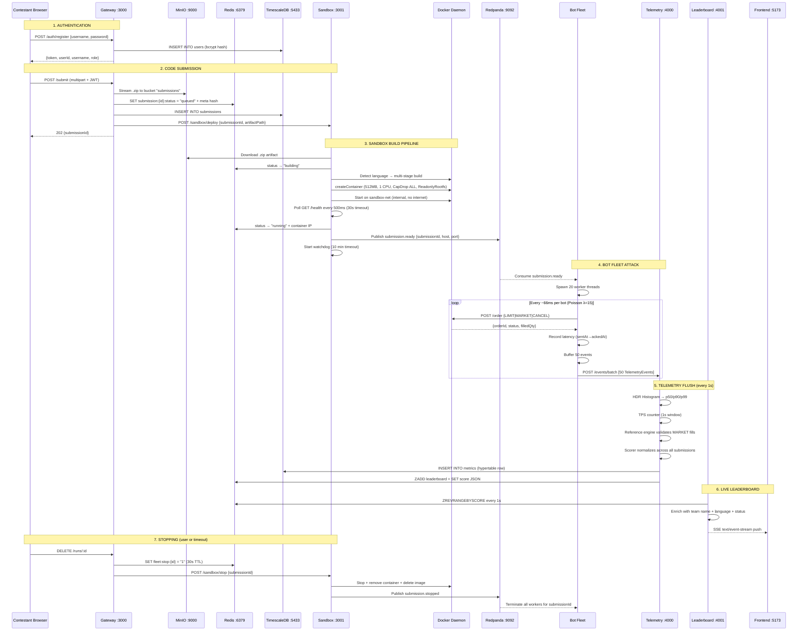

# IICPC Platform — Full Status Report

> **Date:** June 2, 2026 · **Deadline:** June 10, 2026 (8 days remaining)

---

## 1. What This Project Is

This is for the **IICPC Summer Hackathon 2026** (May 9 – June 10). The challenge: build a **Distributed Benchmarking & Hosting Platform** that:

1. Accepts contestant-uploaded trading engine code (C++, Rust, Go)
2. Containerizes it in a **secure, isolated sandbox**
3. Fires a **distributed bot fleet** at it (~300 orders/sec)
4. Captures **real-time telemetry** (latency p50/p90/p99, TPS, correctness)
5. Streams **live rankings** to a leaderboard via SSE

### Scoring Formula
```
compositeScore = (40% × latencyScore) + (40% × throughputScore) + (20% × correctnessScore)
```

### Expected Deliverables for Judges
1. **Working Infrastructure Prototype** — full pipeline demo
2. **Architecture Blueprint** — system design document
3. **Infrastructure as Code** — Docker Compose + k8s manifests

---

## 2. Build Status — Phase by Phase

| Phase | What | Status | Files Exist & Populated? |
|-------|------|--------|--------------------------|
| **Phase 0** | Monorepo + shared types + Docker Compose + migrations | ✅ **Complete** | All present |
| **Phase 1** | Gateway (auth, upload) + Sandbox (build, isolation) | ✅ **Complete** | 14 source files across gateway + sandbox |
| **Phase 2** | Bot Fleet (workers, Poisson timing) + Telemetry (HDR, TPS) | ✅ **Complete** | 12 source files across bot-fleet + telemetry |
| **Phase 3** | Leaderboard (SSE, Redis sorted set, scoring) | ✅ **Complete** | 9 source files in leaderboard |
| **Phase 4** | React Frontend (dashboard, leaderboard, submit, analytics) | ✅ **Complete** | 8 pages + 3 components + 1 context + 19KB CSS |
| **Phase 5** | Kubernetes manifests, HPA, Helm | ⬜ **NOT DONE** | `infra/k8s/` directory does not exist |

> [!IMPORTANT]
> **Phase 5 is the only gap.** Everything else — from code upload to live leaderboard — is implemented.

---

## 3. Full Request Flow (End-to-End Pipeline)



---

## 4. Service Architecture Map

### Network Topology
```
┌──────────────────────── iicpc-network (bridge) ─────────────────────────────┐
│  gateway  sandbox  bot-fleet  telemetry  leaderboard  redpanda  timescale   │
│  redis  minio                                                               │
└─────────────────────────────────────────────────────────────────────────────┘

┌──────────────────── sandbox-net (bridge, internal=true) ────────────────────┐
│  sandbox (dual-NIC)   bot-fleet (dual-NIC)   [submission containers]       │
│  NO outbound internet — Docker --internal flag                              │
└─────────────────────────────────────────────────────────────────────────────┘
```

### 9 Docker Compose Services
| Container | Port | Tech | Role |
|-----------|------|------|------|
| `iicpc-gateway` | 3000 | Express + Drizzle | Public API, auth, file upload, run mgmt |
| `iicpc-sandbox` | 3001 | Express + Dockerode | Container builder, watchdog, isolation |
| `iicpc-bot-fleet` | — | worker_threads | Kafka-driven load generator, 20 bots/sub |
| `iicpc-telemetry` | 4000 | Fastify | HDR histogram, TPS, reference engine, scorer |
| `iicpc-leaderboard` | 4001 | Express + SSE | Live rankings, stats, metrics API |
| `iicpc-redpanda` | 19092 | Redpanda | Kafka-compatible broker |
| `iicpc-timescale` | 5433 | TimescaleDB (PG15) | Metrics hypertable, users, submissions |
| `iicpc-redis` | 6379 | Redis 7.2 | Live state, leaderboard sorted set |
| `iicpc-minio` | 9000/9001 | MinIO | Object store for code archives |

---

## 5. File Inventory — Every Source File

### `packages/shared/src/` — Contract Layer (8 files)
| File | Purpose |
|------|---------|
| [types.ts](file:///c:/Users/LOQ/Desktop/Project/IICPC/packages/shared/src/types.ts) | `Submission`, `MetricSnapshot`, `LiveScore`, `TelemetryEvent`, Kafka event types |
| [schema.ts](file:///c:/Users/LOQ/Desktop/Project/IICPC/packages/shared/src/schema.ts) | Drizzle ORM: `users`, `submissions`, `metrics` tables |
| [db.ts](file:///c:/Users/LOQ/Desktop/Project/IICPC/packages/shared/src/db.ts) | `createDb(pool)` factory |
| [topics.ts](file:///c:/Users/LOQ/Desktop/Project/IICPC/packages/shared/src/topics.ts) | Kafka topic constants |
| [kafka.ts](file:///c:/Users/LOQ/Desktop/Project/IICPC/packages/shared/src/kafka.ts) | `createProducer()` / `createConsumer()` |
| [errors.ts](file:///c:/Users/LOQ/Desktop/Project/IICPC/packages/shared/src/errors.ts) | `SandboxBuildError`, `ContainerTimeoutError` |
| [config.ts](file:///c:/Users/LOQ/Desktop/Project/IICPC/packages/shared/src/config.ts) | `getEnv()` / `getEnvNumber()` fail-fast helpers |
| [index.ts](file:///c:/Users/LOQ/Desktop/Project/IICPC/packages/shared/src/index.ts) | Barrel export |

### `packages/gateway/src/` — API Gateway (8 files)
| File | Purpose |
|------|---------|
| [app.ts](file:///c:/Users/LOQ/Desktop/Project/IICPC/packages/gateway/src/app.ts) | Express: helmet → rate-limit → cors → json → routes |
| [server.ts](file:///c:/Users/LOQ/Desktop/Project/IICPC/packages/gateway/src/server.ts) | HTTP listen + MinIO bucket ensure on startup |
| [setup.ts](file:///c:/Users/LOQ/Desktop/Project/IICPC/packages/gateway/src/setup.ts) | `ensureInfrastructure()` — idempotent bucket creation |
| [db.ts](file:///c:/Users/LOQ/Desktop/Project/IICPC/packages/gateway/src/db.ts) | Drizzle client (pg pool → TimescaleDB) |
| [middleware/auth.ts](file:///c:/Users/LOQ/Desktop/Project/IICPC/packages/gateway/src/middleware/auth.ts) | `requireAuth()` + `requireAdmin()` JWT middleware |
| [routes/auth.ts](file:///c:/Users/LOQ/Desktop/Project/IICPC/packages/gateway/src/routes/auth.ts) | POST /auth/register + POST /auth/login (DB-backed, bcrypt) |
| [routes/submit.ts](file:///c:/Users/LOQ/Desktop/Project/IICPC/packages/gateway/src/routes/submit.ts) | POST /submit — MinIO upload + Redis + PG + sandbox trigger |
| [routes/runs.ts](file:///c:/Users/LOQ/Desktop/Project/IICPC/packages/gateway/src/routes/runs.ts) | GET /runs, GET /runs/:id, DELETE /runs/:id (admin stop) |

### `packages/sandbox/src/` — Sandbox Engine (8 files)
| File | Purpose |
|------|---------|
| [server.ts](file:///c:/Users/LOQ/Desktop/Project/IICPC/packages/sandbox/src/server.ts) | POST /sandbox/deploy, POST /sandbox/stop, GET /sandbox/status |
| [pipeline.ts](file:///c:/Users/LOQ/Desktop/Project/IICPC/packages/sandbox/src/pipeline.ts) | Full build pipeline + watchdog launch |
| [watchdog.ts](file:///c:/Users/LOQ/Desktop/Project/IICPC/packages/sandbox/src/watchdog.ts) | Container lifecycle: detects exit, enforces MAX_RUNTIME_MS |
| [minio-client.ts](file:///c:/Users/LOQ/Desktop/Project/IICPC/packages/sandbox/src/minio-client.ts) | Download artifact from MinIO → /tmp/iicpc/{id}/ |
| [builder.ts](file:///c:/Users/LOQ/Desktop/Project/IICPC/packages/sandbox/src/builder.ts) | Language detection, multi-stage Dockerfiles, `preWarmImages()` |
| [runner.ts](file:///c:/Users/LOQ/Desktop/Project/IICPC/packages/sandbox/src/runner.ts) | `createContainer()` with full isolation, get sandbox-net IP |
| [health-poller.ts](file:///c:/Users/LOQ/Desktop/Project/IICPC/packages/sandbox/src/health-poller.ts) | Poll GET /health every 500ms, 30s timeout |
| [publisher.ts](file:///c:/Users/LOQ/Desktop/Project/IICPC/packages/sandbox/src/publisher.ts) | Kafka: publish submission.ready / submission.stopped |

### `packages/bot-fleet/src/` — Load Generator (3 files)
| File | Purpose |
|------|---------|
| [orchestrator.ts](file:///c:/Users/LOQ/Desktop/Project/IICPC/packages/bot-fleet/src/orchestrator.ts) | Kafka consumer + worker pool (Map\<submissionId, Worker[]\>) |
| [bot-worker.ts](file:///c:/Users/LOQ/Desktop/Project/IICPC/packages/bot-fleet/src/bot-worker.ts) | worker_thread: Poisson loop + circuit breaker + batch telemetry |
| [scenario.ts](file:///c:/Users/LOQ/Desktop/Project/IICPC/packages/bot-fleet/src/scenario.ts) | Order generation: 60% LIMIT / 25% MARKET / 15% CANCEL |

### `packages/telemetry/src/` — Metrics Ingester (9 files)
| File | Purpose |
|------|---------|
| [server.ts](file:///c:/Users/LOQ/Desktop/Project/IICPC/packages/telemetry/src/server.ts) | Fastify: POST /events + POST /events/batch + GET /health |
| [histogram.ts](file:///c:/Users/LOQ/Desktop/Project/IICPC/packages/telemetry/src/histogram.ts) | HDR Histogram per submission (O(1) p50/p90/p99) |
| [tps-counter.ts](file:///c:/Users/LOQ/Desktop/Project/IICPC/packages/telemetry/src/tps-counter.ts) | Sliding 1s window TPS counter |
| [reference-engine.ts](file:///c:/Users/LOQ/Desktop/Project/IICPC/packages/telemetry/src/reference-engine.ts) | Per-submission MARKET order fill validator |
| [scorer.ts](file:///c:/Users/LOQ/Desktop/Project/IICPC/packages/telemetry/src/scorer.ts) | compositeScore = 0.4×latency + 0.4×throughput + 0.2×correctness |
| [flush.ts](file:///c:/Users/LOQ/Desktop/Project/IICPC/packages/telemetry/src/flush.ts) | 1s cycle: histogram → scorer → TimescaleDB + Redis |
| [db.ts](file:///c:/Users/LOQ/Desktop/Project/IICPC/packages/telemetry/src/db.ts) | pg Pool → TimescaleDB |
| [redis.ts](file:///c:/Users/LOQ/Desktop/Project/IICPC/packages/telemetry/src/redis.ts) | Redis client for ZADD leaderboard |
| [routes/events.ts](file:///c:/Users/LOQ/Desktop/Project/IICPC/packages/telemetry/src/routes/events.ts) | Route handlers for single + batch telemetry |

### `packages/leaderboard/src/` — Live Rankings (9 files)
| File | Purpose |
|------|---------|
| [app.ts](file:///c:/Users/LOQ/Desktop/Project/IICPC/packages/leaderboard/src/app.ts) | Express: helmet → cors → routes |
| [server.ts](file:///c:/Users/LOQ/Desktop/Project/IICPC/packages/leaderboard/src/server.ts) | HTTP listen + Redis seed on startup |
| [redis.ts](file:///c:/Users/LOQ/Desktop/Project/IICPC/packages/leaderboard/src/redis.ts) | Read-only Redis client |
| [db.ts](file:///c:/Users/LOQ/Desktop/Project/IICPC/packages/leaderboard/src/db.ts) | pg Pool → TimescaleDB (read-only) |
| [routes/health.ts](file:///c:/Users/LOQ/Desktop/Project/IICPC/packages/leaderboard/src/routes/health.ts) | GET /health |
| [routes/snapshot.ts](file:///c:/Users/LOQ/Desktop/Project/IICPC/packages/leaderboard/src/routes/snapshot.ts) | GET /scores/snapshot — full leaderboard with team names |
| [routes/stream.ts](file:///c:/Users/LOQ/Desktop/Project/IICPC/packages/leaderboard/src/routes/stream.ts) | GET /scores/stream — SSE push every 1s |
| [routes/metrics.ts](file:///c:/Users/LOQ/Desktop/Project/IICPC/packages/leaderboard/src/routes/metrics.ts) | GET /metrics/:id — time-series for charts |
| [routes/stats.ts](file:///c:/Users/LOQ/Desktop/Project/IICPC/packages/leaderboard/src/routes/stats.ts) | GET /scores/stats — platform-wide KPIs |

### `frontend/src/` — React SPA (16 files)
| File | Purpose |
|------|---------|
| [App.tsx](file:///c:/Users/LOQ/Desktop/Project/IICPC/frontend/src/App.tsx) | BrowserRouter + layout shell + route definitions |
| [index.css](file:///c:/Users/LOQ/Desktop/Project/IICPC/frontend/src/index.css) | 19KB global stylesheet (dark theme, glassmorphism) |
| [App.css](file:///c:/Users/LOQ/Desktop/Project/IICPC/frontend/src/App.css) | Additional layout styles |
| [main.tsx](file:///c:/Users/LOQ/Desktop/Project/IICPC/frontend/src/main.tsx) | React root mount |
| [context/AuthContext.tsx](file:///c:/Users/LOQ/Desktop/Project/IICPC/frontend/src/context/AuthContext.tsx) | JWT auth provider (login, register, logout) |
| [components/Sidebar.tsx](file:///c:/Users/LOQ/Desktop/Project/IICPC/frontend/src/components/Sidebar.tsx) | Navigation sidebar |
| [components/Navbar.tsx](file:///c:/Users/LOQ/Desktop/Project/IICPC/frontend/src/components/Navbar.tsx) | Top navigation bar |
| [components/ProtectedRoute.tsx](file:///c:/Users/LOQ/Desktop/Project/IICPC/frontend/src/components/ProtectedRoute.tsx) | Auth guard HOC |
| [pages/LoginPage.tsx](file:///c:/Users/LOQ/Desktop/Project/IICPC/frontend/src/pages/LoginPage.tsx) | Split-screen premium login |
| [pages/RegisterPage.tsx](file:///c:/Users/LOQ/Desktop/Project/IICPC/frontend/src/pages/RegisterPage.tsx) | Registration page |
| [pages/DashboardPage.tsx](file:///c:/Users/LOQ/Desktop/Project/IICPC/frontend/src/pages/DashboardPage.tsx) | KPI cards + time-series charts |
| [pages/LeaderboardPage.tsx](file:///c:/Users/LOQ/Desktop/Project/IICPC/frontend/src/pages/LeaderboardPage.tsx) | Real-time SSE table |
| [pages/SubmitPage.tsx](file:///c:/Users/LOQ/Desktop/Project/IICPC/frontend/src/pages/SubmitPage.tsx) | Upload + progress tracker + stop |
| [pages/MyAnalyticsPage.tsx](file:///c:/Users/LOQ/Desktop/Project/IICPC/frontend/src/pages/MyAnalyticsPage.tsx) | Per-submission deep-dive |
| [pages/ComparePage.tsx](file:///c:/Users/LOQ/Desktop/Project/IICPC/frontend/src/pages/ComparePage.tsx) | Side-by-side comparison |
| [pages/BotActivityPage.tsx](file:///c:/Users/LOQ/Desktop/Project/IICPC/frontend/src/pages/BotActivityPage.tsx) | Bot fleet monitoring |

---

## 6. Data Flow Summary

### Three-Store Architecture
| Store | What's In It | Write From | Read From |
|-------|-------------|------------|-----------|
| **TimescaleDB** | `users`, `submissions`, `metrics` (hypertable) | gateway (users, submissions), telemetry (metrics) | gateway (auth, runs), leaderboard (history, stats) |
| **Redis** | `submission:{id}:status/meta/score`, `leaderboard` sorted set, `fleet:stop:{id}` | gateway (status, meta), sandbox (status, containerId), telemetry (scores) | gateway (status), leaderboard (live rankings), bot-fleet (stop signal) |
| **MinIO** | `submissions/` bucket — uploaded .zip archives | gateway (multer-s3 stream) | sandbox (download for build) |

### Kafka Topics
| Topic | Producer | Consumer | Message |
|-------|----------|----------|---------|
| `submission.ready` | sandbox | bot-fleet | `{submissionId, host, port}` |
| `submission.stopped` | sandbox, gateway | bot-fleet | `{submissionId, reason}` |

---

## 7. What's Done vs. What's Left

### ✅ Fully Implemented (Phases 0–4)
- Monorepo with pnpm + turborepo + shared types
- DB-backed JWT auth (register/login, bcrypt, admin/contestant roles)
- File upload → MinIO (zero disk writes in gateway)
- Container sandbox with full Docker isolation (CapDrop ALL, ReadonlyRootfs, memory/CPU limits, PidsLimit, internal network)
- Multi-language support (C++, Rust, Go) with auto-detection
- Watchdog with MAX_RUNTIME_MS (10 min)
- Bot fleet: 20 workers/submission, Poisson timing, circuit breaker, batch telemetry
- HDR histogram (p50/p90/p99), TPS counter, reference matching engine
- Composite scoring with normalization across submissions
- TimescaleDB persistence (1 row/sec/submission)
- Redis sorted set leaderboard
- SSE streaming to frontend every 1s
- Full React dashboard with 8 pages (login, register, dashboard, leaderboard, submit, analytics, compare, bot activity)
- Container stop/cleanup pipeline (user-initiated + auto-timeout)
- Docker Compose with 9 services, dual network architecture
- Drizzle ORM with migration system
- 5 documentation files (exchange-api, blueprint, database-design, hackathon rules, phase-planner)

### ⬜ Not Yet Done (Phase 5)
| Item | Priority | Estimated Effort |
|------|----------|-----------------|
| **Kubernetes manifests** (`infra/k8s/`) | High — IICPC deliverable | ~4 hours |
| **HPA for bot-fleet** | High — proves horizontal scaling | Included above |
| **Architecture Blueprint polish** | Medium — verify blueprint.md matches code | ~2 hours |
| **Demo preparation** (demo script, pre-seeded submission) | Medium | ~2 hours |
| **Resilience hardening** (graceful shutdown, Kafka DLQ) | Low — nice-to-have | ~3 hours |
| **Helm chart** | Low — stretch goal | ~4 hours |

---

## 8. Key Observations & Concerns

> [!NOTE]
> The codebase is well-structured, with clean separation between services and a solid shared contract layer. Each service has its own Dockerfile and the Docker Compose file is comprehensive.

> [!WARNING]
> **No reference exchange exists in the repo.** The phase planner mentions `scripts/ref-exchange/` but this directory does not exist. You need a working sample exchange to demo the full pipeline.

> [!TIP]
> The `docs/exchange-api.md` includes a complete Go example that could be used as the reference exchange — just save it and zip it.

> [!IMPORTANT]
> **8 days remain.** The only hard deliverable missing is Phase 5 (k8s manifests + IaC). The blueprint doc exists at `docs/blueprint.md` (36KB) but needs verification against actual code.

---

## 9. Recommended Next Steps (Priority Order)

1. **Verify the full pipeline runs end-to-end** — `docker compose up`, register, submit a test exchange, confirm leaderboard updates
2. **Create reference exchange** — save the Go example from `docs/exchange-api.md` into `scripts/ref-exchange/`, zip it
3. **Write Kubernetes manifests** — gateway, sandbox, bot-fleet, telemetry, leaderboard deployments + HPA
4. **Polish blueprint.md** — verify all code snippets match actual implementation
5. **Demo preparation** — cold-start script, pre-built demo submission, walkthrough script
